<link href="styles.css" rel="stylesheet">

# Geometry Run
#### Video Demo:  <https://youtu.be/TC-OAGXKckQ>

# Overview and Game Logic
Geometry Run is a puzzle/platformer. The goal of the game is to reach the end point with the least time possible. The lower the time, the better the score. Players are encouraged to replay for a better score. This game is written in lua using the LOVE framework.

# Architecture

> main.lua

This contains the main game loop and the majority of the logic. Other lua scripts are imported using
`require`.

```lua
require "entity"
require "player"
require "wall"
require "box"
require "platform"
require "longPlatform"
require "invisibleBarrier"
```

Some libraries require a reference to access their fields, luckily `require` can also return a reference to the imported lua script.

```lua
Object = require "classic"
lume = require "lume"
```

## Libraries
1. love
>   The main framework of this game. The LOVE API enables access to its callbacks such as `load()`, `update()` and `draw()`. These callbacks are responsible for initialisation, loop and visualisation of the game. Other modules such as `love.graphics`, `love.sound`, `love.filesystem` provides support to create a complete gameplay experience.
2. Math
>   This build-in library handles mathematical operations. `Math.ceil()`, `Math.floor()` and `Math.abs()` are used extensively to make counting algorithms possible for animation and GUI purposes.
3. lume
>   This library enables system file stream in and out of the lua application. Player highscores are stored locally at "..user\AppData\Roaming\GeometryRun\savedata.txt".
4. Classic
>   This library is essential to the data structure of the game. It enables the creation of classes and their instances and the ability to inherit subclasses from a superclass.

## Love framework

LOVE is an open source lightweight framework that provides essential tools to make 2D games. The most important feature it has is its callbacks.

### love.conf(t)
> This is first callback recieved from Love.  Inside this function, the game's launch configurations are set. This callback is only executed once per game session.
```lua
--This function is called before load()!
function love.conf(t)
    t.window.width = 1600
    t.window.height = 900

    t.window.minwidth = 1200
    t.window.minheight = 720

    t.window.borderless = false
    t.window.resizable = true

    t.window.icon = "/sprites/player/playerJump1.png"
end
```
*love.conf() does not need to be inside main.lua.*

### love.load()
> This is the second callback from Love. This is where the initialisation of variables, tables and their fields take place. This callback is also only executed once per game session.

```lua
function love.load()
------game fields-------
    game =
    {
        state =
        {
            menu = false,
            tutorial = false,
            prep = false,
            playing = false,
            gameOver = false,
        }

    }

    WINDOWS_WIDTH = love.graphics.getWidth()
    WINDOWS_HEIGHT= love.graphics.getHeight()


---------gui fields--------
    menuTextEntryDelay = 0.5

    score = 0
    score_text = ""

    timer = 0
    fontPath = "/font/Xomai.ttf"

    boxIMG = love.graphics.newImage("/sprites/box.png")

-------------sfx------------
    bgm = love.audio.newSource("/sounds/bgm.ogg","stream")
    bgm:setVolume(0.3)
    bgm:setLooping(true)
    bgm:play()

--------check for saved data------

    if love.filesystem.getInfo("savedata.txt") then
        print("HAVE FILE")
        local file = love.filesystem.read("savedata.txt")
        local data = lume.deserialize(file)
        highscore = data.highscore
        highscore_text = formatScore(highscore)

    else
        highscore = 0
    end


---------init all objs---------
    player = Player(-100,450)
    b1 = Box(150,500)
    p = Platform(460,350)

    objects = {}

    table.insert(objects,player)
    table.insert(objects,b1)
    table.insert(objects,p)

---------init tile map---------
    walls={}
    map = {

        --2D table here

    }


---------init game state------
    clearGameState()
    game.state.menu = true
    love.window.setTitle("Geometry Run")

end
```
*Tables are also used to group variables in order to reuse common names.*


### love.update(dt)
This is the main game loop. This function is called every frame and all code inside is executed in the same frame. The `dt` argument is the time elapsed of the last frame. Many logic require this value to correctly increment their quantities namely player movements, animation updates, collisions, physics, scoring and more.

Assuming the application runs at 60 FPS, on average `dt` will be equal to $$ \frac{1}{60} \approx 0.0167 \space seconds$$.

```lua

function love.update(dt)

    -- cache the window size every frame for scalable GUI
    WINDOWS_WIDTH = love.graphics.getWidth()
    WINDOWS_HEIGHT= love.graphics.getHeight()

    if game.state.menu or game.state.tutorial then

        ---------UI ANIMATIONS----------
        if menuTextEntryDelay > 0 then
            menuTextEntryDelay = menuTextEntryDelay - dt
        end

        if menuTextEntryDelay < 0 then
            loopMenuValue(dt,menuTextFadeTime,menuTextAlpha)
        end

    end


    if game.state.playing then

        ----------------entity physics updates--------------
        for k, v in ipairs(objects) do

            v:update(dt)

        end


        --resolve all collisions before updating to next frame
        local isContinueCheck = true
        local limit = 0
        while isContinueCheck do
            isContinueCheck = false
            limit = limit +1

            if limit > 5 then
                break
            end

            for i = 1, #objects-1 do
                for j = 1+i, #objects do

                    local collision = objects[i]:resolveCollision(objects[j])
                    if collision then
                        isContinueCheck = true
                    end

                end
            end

        end

        -----------game updates------------
        timer =  timer + dt
        score = round(timer,3)
        score_text = formatScore(score)

        ----------UI updates---------------

        loopPlayingValue(dt,pTextFadeTime,pTextAlpha)

    end

end
```
*The while-loop inside of this function will be executed in one frame, so it is possible to have lag spikes if the while-loop takes too long to break.*


### love.draw()
This is the second game loop that runs in the next frame after `love.update()`. This loop is responsible for drawing visuals on the game window. The `love.graphics` module is used heavily here to change fonts, set color of the pen used by LOVE to create visuals, print text on the screen etc.

```lua
function love.draw()

    if game.state.tutorial then

        ---background---
        color = util_RBGAtoDEC(243, 165, 251, 1)
        love.graphics.setBackgroundColor(color)

        ---instruction 1---
        changeFont(20)
        love.graphics.setColor(0,0,0,1)
        love.graphics.printf("Arrow keys to move.", 0, WINDOWS_HEIGHT /2 - 60,WINDOWS_WIDTH,"center")

        ---instruction box---
        love.graphics.setColor(1,1,1,1)
        love.graphics.draw(boxIMG,WINDOWS_WIDTH/2 + 250, WINDOWS_HEIGHT/2 -30 -(0.75*(boxIMG:getHeight()/2)) ,0,0.75,0.75)
        love.graphics.setColor(0,0,0,1)
        love.graphics.printf("Boxes are pushable.", 0, WINDOWS_HEIGHT /2 -30  ,WINDOWS_WIDTH,"center")

        --fade text in and out after initial delay
        if menuTextEntryDelay < 0 then

            love.graphics.setColor(1,1,1,menuTextAlpha)
            love.graphics.printf("Press SpaceBar to continue", 0, WINDOWS_HEIGHT /2 +90  ,WINDOWS_WIDTH,"center")

        end

        --footer
        love.graphics.setColor(0,0,0,1)
        love.graphics.printf("Press ESC to quit", 0, WINDOWS_HEIGHT - 30  ,WINDOWS_WIDTH,"center")

    end

end
```
*Graphics drawn by `love.graphics.draw()` or `love.graphics.print()` uses the pen color set by the `love.graphics.setColor(r,g,b,a)`. So it is common that before each image is drawn, the pen color is set back to white by `love.graphics.setColor(1,1,1,1)`.*

### love.keypressed(key)
This callback is triggered everytime a key is pressed by the user. The `key` argument stores the name of the keypress as a string. Comparing a predefined key to the `key` variable enables user input to influence the state of the game.

```lua
function love.keypressed(key)

    if key == "escape" then
        love.event.quit()
        return
    end

    if game.state.playing or game.state.gameOver then

        if key =="r" then
            hotRestart()
            clearGameState()
            game.state.prep = true
        end
        return
    end

end
```

*In the case of player movement, `love.keyboard.isDown()` is used inside `player.lua` instead of `main.lua`. This is crucial for collisions to work properly. See Collisions for more detail.*


## Game State
This game has 5 scenes and therefore 5 states:
1. menu
2. tutorial
3. prep
4. playing
5. gameOver
<br>

>These state are used as boolean flags inside `love.update()` and `love.draw()` to achieve scene dependent logic. There could only be one active state(scene) at a time!

```lua
--initialisation of states
function love.load()

    game =
    {

        state =
        {
            menu = false,
            tutorial = false,
            prep = false,
            playing = false,
            gameOver = false,
        }

    }

end
```
*States can be changed on game events, or triggered by user input!*

An example of using state flags to tell Love what to draw depending on the state of the game:
```lua
function love.draw()

    if game.state.menu then
        --draw menu scene
    end

    if game.state.tutorial then
        --draw tutorial scene
    end

    if game.state.prep then
        --draw preperation scene
    end

    if game.state.playing then
        --draw game scene
    end

    if game.state.gameOver then
        --draw gameOver scene
    end

end
```
```lua
--resets all state flags
function clearGameState()

    game.state.menu = false
    game.state.tutorial = false
    game.state.prep = false
    game.state.playing = false
    game.state.gameOver = false

end
```
*`clearGameState()` is always called before setting a new game state to true.*

### Menu

The `menu` state is the default start up state. This scene consist of the title, a background image and one animated text to inform the player that pressing spacebar will begin the game. Once spacebar is pressed, the game will switch to the `tutorial` state.

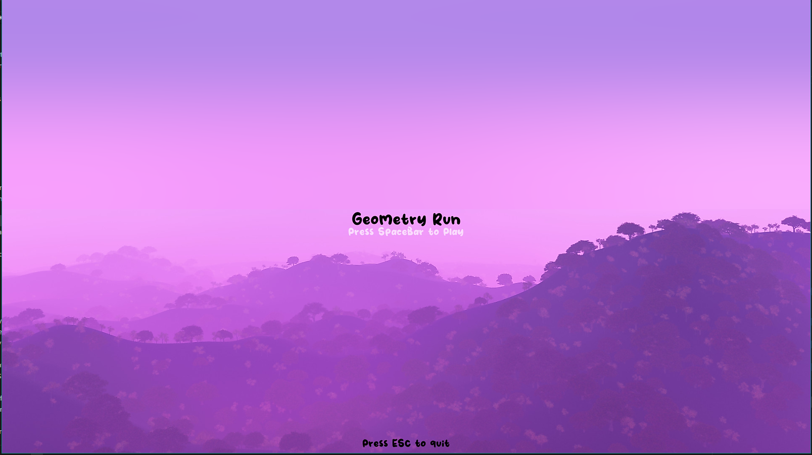

### Tutorial

The tutorial scene gives the player 3 instructions, displays a background color, contains 1 animated text that informs the player pressing spacebar will continue to the next stage of the game. Once spacebar is pressed, the game will switch to the `prep` state.

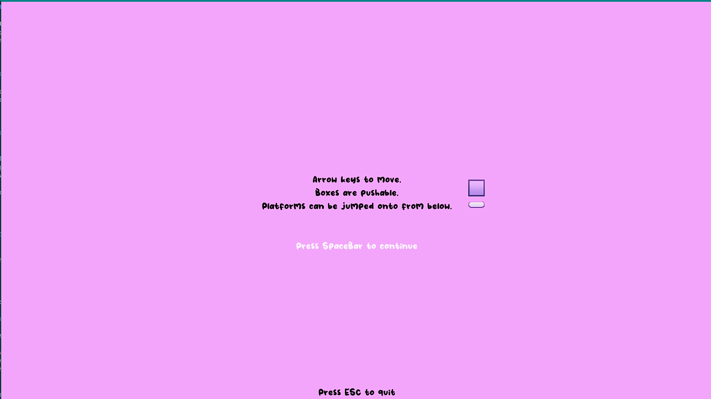

### Preperation

The preperation scene has one simple text, a background color, a timer and a highscore if the player has play this game at least once. Once the timer reaches 0, the game will switch to the `playing` state.

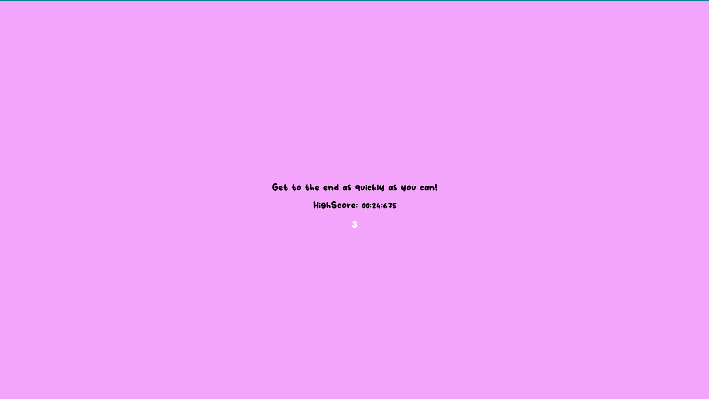

### Playing

This is where the actual game takes place. This scene contains a static map, some obstacles that are either moveable or static, an animated player, a timer, a background image, an animated text to inform the player pressing "r" will restart the game scene, and an animated flag representing the end of the map. This game state will also activate physics behaviour for the player to movearound and collide with objects and not fall through the map. If the player presses "r", this game state will be set to `prep` and all map objects and timers are reset. If the player reaches the flag, the game state will be set to `gameOver`.

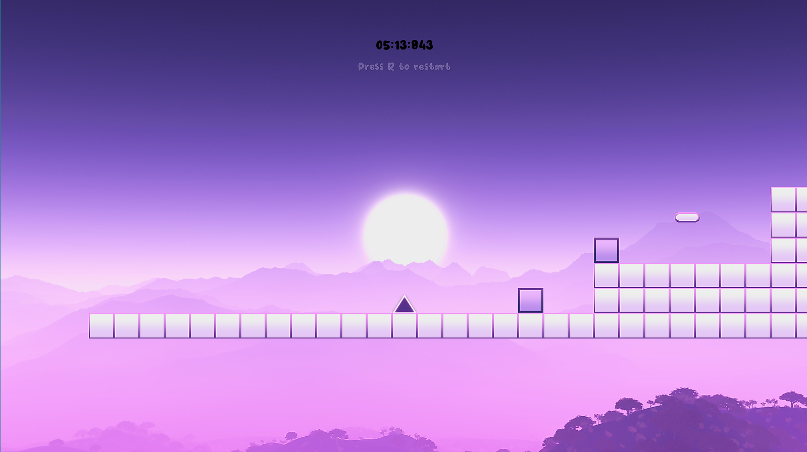
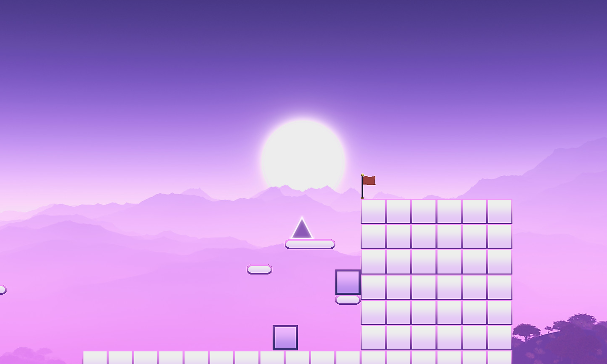

### Gameover

This is the last scene of the game. This scene consist of a text that congratulate the player if they reach a high score or encourage them to try again if they did not. It also consist of an animated text that informs the player pressing "r" will let them retry the level. If the player press "r" the game will switch back to `prep`.

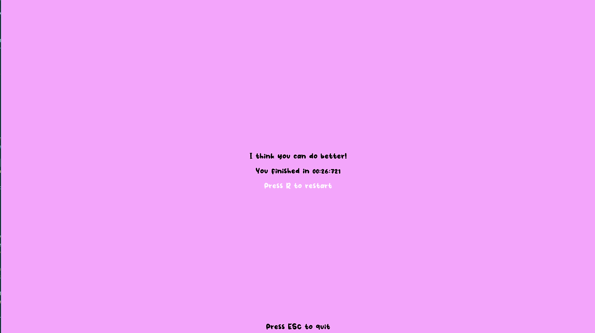

*In any given state, pressing "ESC" will quit the application.*

## Data Structure

 This game consist of a parent/superclass object called `Entity` and all other objects are child/subclass of `Entity`. The `Entity` class act as a blueprint for these subclasses: `Player`, `Wall`, `Platform`, `LongPlatform`, `Box` and `InvisibleBarrier`. In plainer words, the player, the wall, the platform, the long Platform, the box and the invisible Barrier are all entities, but the player for example, can have extra functionalities that differs from other entities such as the wall or the box.


> The `classic` library allows for the implementation of classes in lua.

The `classic` library must be imported in either `Entity.lua` or  `main.lua`. The latter is possible because `Entity.lua` is imported anyway after importing `classic`:

```lua
--in main.lua

Object = require "classic"
require "Entity.lua"
```
To create a the `Entity` class:

```lua
--in Entity.lua

-- Entity is now a class extended/inherited from the "classic" base object called Object
Entity = Object:extend()
```
In `Entity.lua`, there are 3 non collision related functions defined.

> An instance of `Entity` can be created by calling `Entity()`, `Entity:new()` is the constructor for the base `Entity` class.

```lua

function Entity:new(x,y,image_path)

    --all subclasses of Entity have these fields as well
    self.x = x
    self.y = y
    self.image = love.graphics.newImage(image_path)
    self.width = self.image:getWidth()
    self.height = self.image:getHeight()

    self.materialStrength = 0
    self.name = ""

end
```
*Inside of the constructor function, all base fields of `Entity` are declared and populated.*

```lua
function Entity:update(dt)

    --handles movement or collision related logic (more detail later)

    --updates self.x and self.y

end

function Entity:draw()
    --draws image at coordinates self.x, and self.y
    love.graphics.draw(self.image,self.x,self.y)
end
```
*The `self` keyword in lua is a way to reference the instance of the object passed into the function. When a function is defined with a `:` symbol instead of a `.`, any instance calling such functions must pass itself into the function as an argument, for example: `<instance_of_entity>.func(self)` or `<instance_of_entity>:func()`*

>Subclasses of `Entity` inherit these base functions and they can override them.

Since `Player` is the most complicated subclass of `Entity` and other subclasses derives from the same yet simpler concept, the understanding of the working principle of `Player` is transferrable to said subclasses.

> To create a subclass `Player` that inherits from superclass `Entity`, write on the first line of `player.lua`:

```lua
Player = Entity:extend()
```

In `player.lua`, the `new()` constructor function is overrided to take only `x` and `y` as arguments.
However, in order to create an instance the `Player` subclass, the super class `Entity` have to be instanced first.

>All subclass constructors does not have `image_path` as argument because within their respective scripts, the image path is hard coded in the argument when the `Entity` superclass is instanced.

```lua
--inside player.lua
Player = Entity:extend()

function Player:new(x,y)

    --instances the superclass with the instance of this subclass using the "self" keyword
    Player.super.new(self,x,y,"sprites/player/player1.png")

    --Player specified fields (in super class)
    self.materialStrength = 10
    self.name = "player"

    --Player's unique fields (NOT in super class)
    self.canJump = false

end
```
*Subclasses can have their unique fields declared inside their own constructor. These fields will not exist in or affect the superclass.*

*Note that the self keyword here represents the instance of `player` and `super` represents the instance of `Entity`. If `Player.super:new()` is used instead, the `Player` subclass will not be instanced because the `:` symbol here passes the `super`'s instance into `Entity`'s `new()` function. For details please read `classic`'s documentation.*

Inside `main.lua`, the player object is instanced inside `love.load()` and stored inside table `objects`.
```lua

function love.load()
    --initialise player at (-100,450)
    player = Player(-100,450)

    objects = {}

    table.insert(objects,player)

end
```
*Recall in `Player.lua`, Player:new() only has 2 arguments!*

Once the player is instanced as the variable `player`, all functions inherited from `Entity` or uniquely declared inside the `Player` subclass can be called using:

```lua
player:update()
```

For the purpose of this game, physics are handled in the `update()` function in all subclasses of `Entity`.In the `Player` subclass, user input and movement are processed on top of physics. So it is important that the data structure this game chooses allows for an inheritance structure where complex subclasses share the basic functionality of its sibling classes without the need to repeat the same code.

>The elegance of the inheritance structure will be revisited in the Physics section.

## Physics
The physics of this game comprise of 2 main aspects:

1. Kinematics
1. Collisions

To begin understanding the physics of the game, having a frame of reference (position of (0,0)) and defining a pair of orthogonal axis is vital.

By default, the screen's top left corner will be positioned at (0,0) of the coordinate system, the horizontal axis increases from left to right while the vertical axis increases from top to bottom.

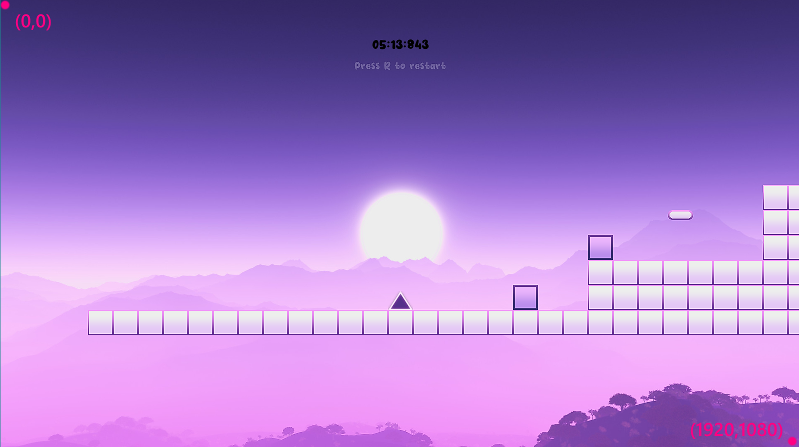

*In a 1920x1080 sized window, the bottom right pixel will be exactly (1920,1080)*

### Kinematics

The kinematics of this game has 2 parts: gravity and movement. Both are essential for creating realism for the player when they traverse on a bunch of "floating" blocks.

#### Movement

Movement is the core feature of most games. In this game, the player is controlled by user input. The way to convey movement is to increment the horizontal and vertical position of the player in the `love.update()` loop and then draw the player at the updated position in the `love.draw()` loop.

> To make sure that all entities have their phyiscs updated synchronously, all entity instances will call their respective `update()` function inside `love.update()`.

```lua
function love.update(dt)
    for k, v in ipairs(objects) do

        v:update(dt)

    end
end
```
*The `objects` table contains all entities except walls.*

All entities have a position related field `self.x` and `self.y`. They represent the current horizontal and vertical position of the entity.

```lua
function Entity:new(x,y,image_path)

    self.x = x
    self.y = y
    self.spawnX = x
    self.spawnY = y
    self.image = love.graphics.newImage(image_path)
    self.width = self.image:getWidth()
    self.height = self.image:getHeight()

    self.name = ""
end
```
*`self.x` and `self.y` are set to the spawn coordinate of that entity at initialisation, these two variables will be updated frequently if the entity is a dynamic object such as the player or the boxes.*


>To move the player, increment the `self.x` or `self.y` variable in `update()`.

```lua
--inside player.lua
function Player:update(dt)
    -- moves player to the right by 200*dt units per frame
    self.x = self.x + 200 * dt
end
```
*The 200 here is a hardcoded value that represents the speed factor of the player. 200 is not 200 m/s per say but a value that could be calibrated to determine how fast the player moves.*

However, the player requires unique features, therefore `player:update()` not only uses the base `update()` logic from `Entity`, but with code that handles user input, jumping, animations and sound effects as well.

>Combine user input and movement using the `love.keyboard` module.

```lua
function Player:update(dt)

    -------------jump logic------------
    --see later

    --------gravity and collisions-------
    Player.super.update(self,dt)
    --see later

    --------movement logic------------
    if love.keyboard.isDown("left") then
        self.x = self.x - 200 * dt
    elseif love.keyboard.isDown("right") then
        self.x = self.x + 200 * dt
    end

    ------------animation logic---------
    --see later
    ------------sfx updates--------------
    --see later

end
```
*When the user presses the left arrow key, the player moves to the left; when the user presses the right arrow key, the player moves to the right.*

Finally, to visualise movement, the player along with all other objects are drawn on the screen one frame after `love.update()` is called.

```lua
--inside main.lua
function love.draw()
    for k, v in ipairs(objects) do
        v:draw()
    end
end
```
>Recall that `v:draw()` calls the defined function `draw()` inside the superclass `Entity`, if no subclasses overrides this function.
```lua
function Entity:draw()
    love.graphics.draw(self.image,self.x,self.y)
end
```
*This is a simiplified way to implement movement, the player will eventually move out of the screen. For games that have a map that is bigger than 1920x1080 such as this one, the game window has to follow the player whilst keeping static objects in the correct relative position to the player. See Camera Follow Effect for more details.*

#### Gravity and jumping

Gravity is required for the player and boxes only. Since all game scene object are entities, inside the constructor of `Entity`, fields such as `downwardsVelocity` and `gravity` is added. `downwardsVelocity` is the velocity factor of the entity, whilst `gravity` is the acceleration factor. `gravity` is kept at 900 for the player, whereas the `Box` object has `gravity` set at 850 as it simulates "air resistance" so it falls slower than the player. All other entities are static objects, so their `gravity` values are set to zero.

```lua
--all objc
function Entity:new(x,y,image_path)

    self.x = x
    self.y = y
    self.image = love.graphics.newImage(image_path)
    self.width = self.image:getWidth()
    self.height = self.image:getHeight()

    self.materialStrength = 0

    -- Add the gravity and weight properties
    self.downwardsVelocity = 0
    --g is constant across all objects
    self.gravity = 900
end
```

```lua
--inside box.lua
function Box:new(x,y)
    Box.super.new(self,x,y,"sprites/box.png")
    self.materialStrength = 1
    self.name = "box"
    self.gravity = 850
end
```
Besides adding new fields to the constructor of `Entity`, the `update()` function of `Entity` needs to be appended as well. The downwards velocity factor of all entities are updated every frame. The bigger their `gravity` variable, the faster `downwardsVelocity` will grow. Following that, the vertical position of the entity is incremented.

```lua
function Entity:update(dt)

    self.downwardsVelocity = self.downwardsVelocity + self.gravity*dt
    self.y = self.y + self.downwardsVelocity*dt

end
```

*Recall objects moves by a very small amount per frame using the `dt` argument, a value bigger than 1 can be multiplied onto `dt` to achieve a larger increment per frame*

Implementing jumping is similar to gravity, but in the opposite direction. Since the vertical position of the player is incremented by a velocity factor, changing `downwardsVelocity` to a negative value will send the player in a upwards trajectory.

>`jump()` is called when the user press the up arrow key.

```lua
function Player:update(dt)

    -------------jump logic------------
    if love.keyboard.isDown("up") then
        self:jump()
    end
end

function Player:jump()

    if not self.canJump then
        return
    end
    jumpSound:play()
    self.downwardsVelocity = -350
    self.canJump =false

end
```
*`self.canJump` is a boolean gate that controls whether the player can jump or not. This variable is set to false when the player jumps and when the player is in mid-air, and is set to true when the player collides with the top surface of any other entity*

Fortunately, the player will not indefinitely travel upwards, thanks to how gravity is implemented. Since `downwardsVelocity` is always increasing per frame, it will eventually become zero and turn positive again, effectively modelling the vertical velocity of a realistic projectile motion.

### Collisions

In almost every platformer, collisions are the bread and butter of the game. All entities in this game have collision built into their base functionality in `entity.lua`. Before detailing how collisions are handled in this game, the basic concept of collision has to be discussed.

#### Detecting Collisions

Consider 2 rectangles. Rectangle A has width `A.width` and length `A.length` while rectangle B  has  width `B.width` and length `B.length`. Rectangle A has coordinates `A.x` and `A.y` while rectangle B has coordinates `B.x` and `B.y`. These cooridnates are pivoted at the top left corner of these rectangles.

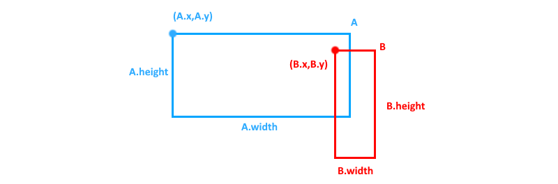

*The thickness of the borders are negligible, recall that the top left corner of the screen is (0,0) and `x` increases rightwards whereas `y` increases downwards.*

In order for these 2 rectangular objects to collide, the following conditions must be satisfied simultaneously:

1) >` A.x + A.width > B.x`
2) >`A.x < B.x + B.width`
3) >`A.y + A.height > B.y`
4) > `A.y < B.y + B.height`

To check for collision between entities, an instance of entity calls `checkCollision()` defined in `entity.lua`, while passing the instance of another entity as variable. `checkCollision()` returns true when all the conditions are met and false otherwise.

> The entity instance that called `checkCollision()` will always be referenced by the `self` keyword.

```lua
function Entity:checkCollision(target)
    return self.x + self.width > target.x
    and self.x < target.x + target.width
    and self.y + self.height > target.y
    and self.y < target.y + target.height
end
```

Finally, all entities are put in a loop and collisions between them are checked without repeat (order does not matter here, meaning if A checked collisions with B, B does not need to check collisions with A).

```lua
function love.update(dt)
    for i = 1, #objects-1 do
        for j = 1+i, #objects do
            objects[i]:checkCollision(objects[j])
        end
    end
end
```
*`#objects` returns the number of elements inside the table `objects`.*

Checking for collisions is only the first step, resolving them accordingly will be the next.

#### Resolving Collisions

##### 2-body Collisions
Resolving a collision involves breaking apart a collision and setting the 2 colliding bodies in a way such that they are just touching each other. However there is an conundrum:

>If one body collides with another, which colliding body should move? Should the moving body be "bounced" back? Or should the recieving body be pushed forward?

Fortunately for games, it is intuitive that static walls/plaforms should not be pushed by anything, while dynamic objects such as boxes should be able to move in the direction of where the player is pushing them from.

To implement such behaviour, a `materialStrength` field is added into the each entity.

```lua
--in Entity.lua
function Entity:new(x,y,image_path)
    ----------------
    --other fields--
    --     ...    --
    ----------------

    self.materialStrength = 0
end
```
```lua
--in platform.lua
function Platform:new(x,y)
    Platform.super.new(self,x,y,"sprites/platform.png")
    self.materialStrength = 100
end
```
*The `materialStrength` variable is set at initialisation by each subclass of `Entity`.*

 Static entities will always have a higher strength value than dynamic entities, whereas between dynamic entities, the one that "moves" the rest of the entites will have a moderate strength value and the rest will have the lowest strength value.

In this game, the strength values are distributed as follow:


>   Walls and platforms:  100       <br>
>   Player:  10                     <br>
>   Box:  1


When a light object collides with a heavy object whilst coming from the left, the light object is send back to the left while the heavy object stays in place. As for how much the object has to be sent back, that depends on the width of the light object only.

Consider the same rectangle A and B and they are now subclasses of `Entity`. A travels from left to right colliding with a static object B. A will be sent back to the left by just the right amount where its right side touches B's left side, and B remains in the same position.

> `checkCollision()` is called inside a new function `resolveCollision()`. If `checkCollision()` returns true, and if the caller of `resolveCollision()` is *ligher* than the instance it passes ,`target`, and if the caller is on the left of the target, the collision is resolved.

```lua
--in main.lua
function love.update(dt)

    -----loop over all objects----

        instance_A:resolveCollision(instance_B)

    -------------------------

end
```
*`instance_A` and `instance_B` are initialised before the first `update()` callback. *

```lua
-- in entity.lua
function Entity:resolveCollision(target)

    -- collision in this frame?
    if self:checkCollision(target)  then

        --if the caller's is heavier than the target, call resolveCollision again with target being the caller and the original caller as the target.
        if (target.materialStrength < self.materialStrength)then

            return target:resolveCollision(self)

        end

        --check if mid point of self is more left than the mid point of target
        if self.x + self.width/2 < target.x + target.width/2 then
            --resolve the collision
            self.x = self.x - (self.x + self.width - target.x)
        end


    end

end
```
*The reason why the caller must be the one calling the `resolveCollision()` function, it is due to how the last part is written. `self` is always the one being moved back, never the `target`. So `self` must have a smaller strength value than `target`.*

On paper this is how a perfectly head on collision from the left is resolved. However, in most cases, collisions can occur at any incoming direction. The current collision system will break if rectangle A collides with B coming from the top given that A is slightly more to the left than B. Resolving the collision using the code above will result in A snapping on B's left side regardless of how A collides with B, as long as A is slightly more left than B.

>`checkCollision()` only checks for a generic collision at the current frame, it will not give any information about how the collision happened (A hits B from what direction etc).

To tackle this problem, 2 new fields are needed for each entity.

```lua
function Entity:new(x,y,image_path)
    ----------------
    --other fields--
    --     ...    --
    ----------------

    self.lastX = x
    self.lastY = y

end
```

By caching the the position of each entity every frame before any movement/collision updates, at the frame where the collision actually happened. Entities can compare their last-frame positions, to determine whether they were already horizontally colliding or vertically colliding.

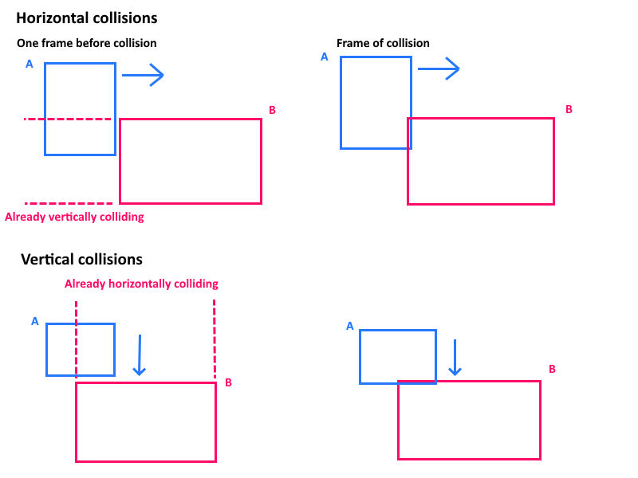

*When A is about to horizontally collide with B, they must already be vertically colliding and vice versa.*

> In `Entity:update()`, `self.lastX` and `self.lastY` are set to the current position of the entity BEFORE any updates.

```lua
function Entity:update(dt)

    --CACHE FIRST
    self.lastX = self.x
    self.lastY = self.y

    --THEN UPDATE GRAVITY!
    self.downwardsVelocity = self.downwardsVelocity + self.gravity*dt
    self.y = self.y + self.downwardsVelocity*dt

end
```
Define a new function, `isLastFrameVerticallyColliding()`. This functions is called before resolving horizontal collisions by comparing the `lastY` values of the colliding entities.

```lua
function Entity:isLastFrameVerticallyColliding(target)
    return  self.lastY + self.height > target.lastY
    and self.lastY < target.lastY + target.height
end
```
*This is half of the conditions inside `checkCollision()`, in this case only the vertical collision conditions needs to be met in order to return true.*


Finally, puting everything together, horizontal collisions are now resolved without unexpected behaviour.

```lua
-- in entity.lua
function Entity:resolveCollision(target)

    -- collision in this frame?
    if self:checkCollision(target)  then

        -- vertically colliding in the last frame?
        if self:isLastFrameVerticallyColliding(target) then

            --if the caller's is heavier than the target, call resolveCollision again with target being the caller and the original caller as the target.
            if (target.materialStrength < self.materialStrength)then

                return target:resolveCollision(self)

            end

            --check if mid point of self is more left than the mid point of target
            if self.x + self.width/2 < target.x + target.width/2 then
                --resolve the collision
                self.x = self.x - (self.x + self.width - target.x)
            end

        end

    end

end
```

The same concept applies to vertical collisions, but for the sake of simplicity in this part, only horizontal collisions are considered. For a step by step demostration of how this game implements its collisions, check *Implementing Collision* for more.


##### N-body Collisions

In this game, the player can push a box into the wall and the wall theorectically should stop all entities from going through itself. However, with only 2-body collisions and a single for-loop per frame to check collisions between all objects, the player could potential clip into the box and eventually come to a stop when the it collides with the wall.

To solve this problem, 2 new fields are required to store the temporary material strength obtained during a series of collisions. With this new variable, the box can temporarily share the same strength value as the wall so when the player collides on to it, the player will be pushed back.

```lua
function Entity:new(x,y,image_path)

    ----------------
    --other fields--
    --     ...    --
    ----------------

    self.tempStrengthX = 0
    self.tempStrengthY = 0

end
```

Inside `resolveColliion()`, if the current frame collision is horizontal, then set `self.tempStrengthX` to `target.tempStrengthX`.

```lua
function Entity:resolveCollision(target)

    -- collision in this frame?
    if self:checkCollision(target)  then

        -- vertically colliding in the last frame?
        if self:isLastFrameVerticallyColliding(target) then

            --!
            --lighter object inherits strength of stronger object
            self.tempStrengthX = target.tempStrengthX

            if (target.materialStrength < self.materialStrength)then

                return target:resolveCollision(self)

            end

            --check if mid point of self is more left than the mid point of target
            if self.x + self.width/2 < target.x + target.width/2 then
                --resolve the collision
                self.x = self.x - (self.x + self.width - target.x)
            end

        end

    end

end
```
All temporary strength values are set back to their entities' default every `update()`.
```lua
function Entity:update(dt)

    --CACHE FIRST
    self.lastX = self.x
    self.lastY = self.y

    --RESET STRENGTH VALUESS
    self.tempStrengthX = self.materialStrength
    self.tempStrengthY = self.materialStrength

    --THEN UPDATE GRAVITY!
    self.downwardsVelocity = self.downwardsVelocity + self.gravity*dt
    self.y = self.y + self.downwardsVelocity*dt

end
```

Howevver, this works fine only when the player resolves collision with the box AFTER the box has resolved collision with the wall. Fortunately, while-loops can be used in `love.update()` to resolve collisions between all objects multiple times in the same frame. So even if the player has resolve collision with the box before the box has its strength updated, the while loop will make sure the player resolves collisions with the box again in the next tick.

>`resolveCollision()` is tweaked slightly to return true when the collision is resolved, it returns false otherwise.

> The while-loop is set to break in the begining of the tick, only when there are collisions still being resolved will the while-loop be allowed to continue.
```lua
--in main.lua
function love.update()

    --resolve all collisions before next user input/gravity update
    local isContinueCheck = true
    local limit = 0
    while isContinueCheck do
        isContinueCheck = false
        limit = limit +1

        -- breaks then there is more than 10 consecutive collisions resolved to let the frame pass
        if limit > 10 then
            break
        end

        for i = 1, #objects-1 do
            for j = 1+i, #objects do

                local collision = objects[i]:resolveCollision(objects[j])
                if collision then
                    isContinueCheck = true
                end

            end
        end
    end
end
```
*It is crucial to set a limit to how many consecutive collisions are allowed to be resolved, or the while-loop will go on indefinitely and freeze the application.*

Again, the same concept applies to vertical collisions where `self.tempStrengthY` is set to `target.tempStrengthY`. The reason behind seperating temporary strength to 2 directions is because vertical collisions should not interfere with horizontal ones. If the player resolved collisions with the "wall" block that is placed under the player, using one temporary strength variable means the player inherited the material strength of the wall, thus affecting its strength comparison horizontally with other entities and cause unexpected behaviours.

#### Implementing Collision

This game adopts the N-body collision system and an additional filter per collision for anisotropic collision behaviours. An example of such behaviour is when the player collides with the platform from any direction other than from the top, collisions are ignored as to allow the player to jump onto the platform from underneath.

In `entity,lua`, `resolve()` abstracts the logic for moving `self` depending on which direction it approached the heavier object. `isAllowResolve()` is now called before resolving the collision to filter for unique collision behaviour between certain subclasses.

```lua
function Entity:resolve(target,comingFrom)

    if comingFrom == "left" then
        self.x = self.x - (self.x+self.width - target.x)
        --print("moving ".. self.name .. " to the left")
    end
    if comingFrom == "right" then
        self.x = self.x + (target.x + target.width - self.x)
        --print("moving ".. self.name .. " to the right")
    end

    if comingFrom == "up" then
        self.y = self.y - (self.y + self.height - target.y)
        --print("moving ".. self.name .. " to the top")
    end

    if comingFrom == "down" then
        self.y = self.y + (target.y + target.height - self.y)
        --print("moving ".. self.name .. " to the bottom")
    end

end
```
```lua
--for anisotropic collision behaviour, default returns true when the entity subclass doesnt override it
function Entity:isAllowResolve(target,comingFrom)
    return true
end
```

> Anisotropic collisions are require for player related collisions only, `resolve()` and `isAllowResolve()` are overriden for player specific behaviours in `player.lua` .

Every time the player is resolved upwards, means the player has landed on another entity. In `player.lua`, the `resolve()` function is overrided by first calling the base function of `resolve()` then checking if the player came from above the target.

```lua
--only the player needs to reset the jump bool
function Player:resolve(target,comingFrom)

    Player.super.resolve(self,target,comingFrom)

    if comingFrom == "up" then
        self.canJump = true
    end

end
```
*Setting `self.canJump` to `true` will allow the player to jump again.*

When the player collides with any boxes, the box should make a grinding sound with the ground but not when the player is standing on top of the box. In `isAllowResolve()`, the target class is checked, followed by checking if the player is approaching the target horizontally. If all conditions are met, a sound effect will be played.

> This function will return always `true` if no extra behaviours stops the collision from getting resolved.

```lua

function Player:isAllowResolve(target,comingFrom)

    if target:is(Box) then

        if comingFrom =="right"  or comingFrom =="left"  then
            isPlayBoxSound = true
        end

        return true

    end

    return true
end
```

To enable the player to jump through the platforms, create another check for if the class type of the target then check if the player is approaching from the top. If the latter condition is not met, return false and that collision will not be resolved, allowing the player to go through the platform.

```lua

function Player:isAllowResolve(target,comingFrom)

    if target:is(Box)  then

        if comingFrom =="right"  or comingFrom =="left"  then
            isPlayBoxSound = true
        end

        return true

    end

    if target:is(Platform) or target:is(LongPlatform) then

        if comingFrom =="up" then
            return true
        end

        return false

    end

    return true
end
```

Finally append all of the above inside `Entity:resolveCollision()`, along with the vertical part that the previous section left out and a part where all entities will have their `downwardsVelocity` value set to zero when they collide onto another entity from the top. This concludes how collisions are handled in this game, the exact code snippet below is used in production.

```lua
function Entity:resolveCollision(target)

    if self:checkCollision(target)  then

        --RESOLVE horizontal collision
        if self:isLastFrameVerticallyColliding(target) then

            if (target.tempStrengthX < self.tempStrengthX) then
                return target:resolveCollision(self)
            end

            --lighter object inherits strength of stronger object
            self.tempStrengthX = target.tempStrengthX

            --self coming from left
            if self.x + self.width/2 < target.x + target.width/2 then

                if self:isAllowResolve(target,"left") and target:isAllowResolve(self,"right") then
                    self:resolve(target,"left")
                else
                    -- there is no collision resolved
                    return false
                end
            --self coming from right
            else

                if self:isAllowResolve(target,"right") and target:isAllowResolve(self,"left") then
                    self:resolve(target,"right")
                else
                    -- there is no collision resolved
                    return false
                end

            end

        --RESOLVE vertical collision
        elseif self:isLastFrameHorizontallyColliding(target) then

            if (target.tempStrengthY < self.tempStrengthY)then
                return target:resolveCollision(self)
            end

            --lighter object inherits strength of stronger object
            self.tempStrengthY = target.tempStrengthY

            --self coming from up
            if self.y + self.height/2 < target.y + target.height/2 then

                if self:isAllowResolve(target,"up") and target:isAllowResolve(self,"down") then
                    self:resolve(target,"up")
                    --all entities will reset their downwards v
                    self.downwardsVelocity = 0
                else
                    -- there is no collision resolved
                    return false
                end
            --self coming from down
            else

                if self:isAllowResolve(target,"down") and target:isAllowResolve(self,"up") then
                    self:resolve(target,"down")
                else
                    -- there is no collision resolved
                    return false
                end

            end
        end
        -- there is collision resolved
        return true

    end
    -- there is no collision between the 2 objects in this frame
    return false
end
```
*The reason why `self:isAllowResolve(target)` AND `target:isAllowResolve(self)` must be checked simuntaneously is because all unique behaviours are overriden in `player.lua` but `self` does not always represent the player. In the player-box collison, the box's strength is lower than the player so `box:resolveCollision(player)` is called instead of `player:resolveCollision(box)`. Forcing `target` and `self` to swap places and run `isAllowResolve()` again will ensure `player:isAllowResolve(box)` to be called and proceed with the player specific behaviour.*


# Key Design Elements

## Map

The map in the game is created by a 2D table of zeros and ones, representing nothing and a wall tile respectively.

```lua
--inside main.lua ; love.load()

    walls={}
    --each wall image sprite is 50 px in height and width
    wallSize = 50

    map = {

        {0,0,0,0,0,0,0,0,0,0,0,0,0,0,0,0,0,0,0,0},
        {0,0,0,0,0,0,0,0,0,0,0,0,0,0,0,0,0,0,0,0},
        {0,0,0,0,0,0,0,0,0,0,0,0,0,0,0,0,0,0,0,0},
        {0,0,0,0,0,0,0,0,0,0,0,0,0,0,0,0,0,0,0,0},
        {0,0,0,0,0,0,0,0,0,0,0,0,0,0,0,0,0,0,0,0},
        {0,0,0,0,0,0,0,0,0,0,0,0,1,1,1,1,1,1,1,0},
        {0,0,0,0,0,0,0,0,0,0,0,0,1,1,1,1,1,1,1,0},
        {0,0,0,0,0,0,0,0,0,0,0,0,1,1,1,1,1,1,1,0},
        {0,0,0,0,0,1,1,1,1,1,1,1,1,1,1,1,1,1,1,0},
        {0,0,0,0,0,1,1,1,1,1,1,1,1,1,1,1,1,1,1,0},
        {1,1,1,1,1,1,1,1,1,1,1,1,1,1,1,1,1,1,1,1}

    }
```

The ones' positions on the 2D table are translated into relative game coordinates in pixels using a simple algorithm inside a for-loop. A `Wall` object is constructed by calling `Wall()`. `Wall` being the subclass of `Entity` have its own constructor arguments `Wall:new(x,y)`.

```lua
function Wall:new(x,y)

    Wall.super.new(self,x,y,"sprites/wall.png")
    self.materialStrength = 100
    self.name = "wall"

    self.gravity = 0

end
```
All wall objects are instanced with the translated pixel values passed in as `x` and `y`, and are inserted into the table `walls`

```lua
--inside main.lua ; love.load()

    for i, row in ipairs(map) do

        for j, col in ipairs(row) do

            if col == 1 then
                table.insert(walls, Wall((j-1)*wallSize , (i-1)*wallSize))
            end

        end

    end

```

*The top left element of the `map` table will have game coordinates (0,0) while the bottom right element will have game coordinates $$(col-1)\times wallSize\space,\space(row-1)\times wallSize$$ with col = 20 and row = 11 in this example.*


The `walls` table is then looped through and each instance of `Wall` is drawn on the screen by
calling `draw()`.

```lua
--inside main.lua ; love.draw()
    for k, v in ipairs(walls) do
        v:draw()
    end
```

Recall that `draw()` is defined in `Wall`'s superclass `Entity`.

```lua
--inside Entity.lua
    function Entity:draw()
        love.graphics.draw(self.image,self.x,self.y)
    end
```

The result of such a map in this example looks like this (ignore the player and the platform):

  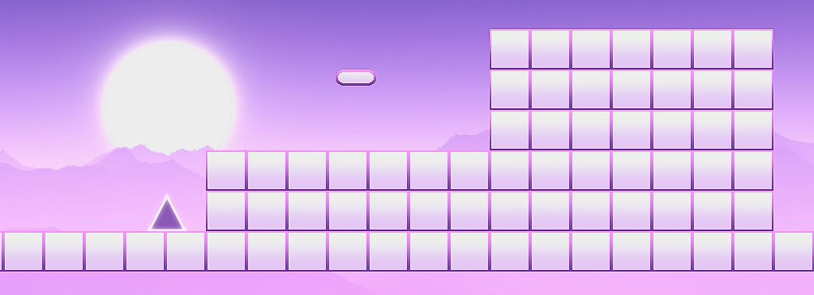

## Animation

There are only 3 animations in the entire game, player running, player jumping and the end waving flag. Animations are created by drawing a different sprite every multiple frames.

The sprites are first initialised and are put into a table. A global variable is then incremented per frame in `love.update()`. Finally, that variable is turned into an integer using `math.floor()` and indexed into the sprites table to find a sprite to draw every frame.

```lua
-- static fields inside player.lua
run = {}
run.frames ={}

table.insert(run.frames, love.graphics.newImage("sprites/player/player1.png"))
table.insert(run.frames, love.graphics.newImage("sprites/player/player2.png"))
table.insert(run.frames, love.graphics.newImage("sprites/player/player3.png"))
--...

run.currentFrame = 1
run.animationSpeed = 25

jump ={}
jump.frames ={}

table.insert(jump.frames, love.graphics.newImage("sprites/player/playerJump1.png"))
table.insert(jump.frames, love.graphics.newImage("sprites/player/playerJump2.png"))
table.insert(jump.frames, love.graphics.newImage("sprites/player/playerJump3.png"))
--...
jump.currentFrame = 1
jump.animationSpeed = 75
```
*These fields can be static because there is only one instance of player at any given time.*

In `Player.update()`, if the player is in the air, increment the `currentFrame` variable in the `jump` table. Otherwise increment the `currentFrame` variable in the `run` table. These variables are set back to 1 when they exceed $$ (the\space total\space number\space of\space sprites\space to\space loop\space over\space )+ 1 $$

> `animationSpeed` is multiplied onto `dt` to adjust how fast `currentFrame` reaches the next integer.

```lua
function Player:update(dt)

    ------------animation logic---------
    if not self.canJump then
        --jump anim if canJump is false
        jump.currentFrame = jump.currentFrame + jump.animationSpeed*dt

        if jump.currentFrame> #jump.frames + 1 then
            jump.currentFrame = 1
        end
    else
        --walk anim if canJump is true
        run.currentFrame = run.currentFrame + run.animationSpeed*dt

        if run.currentFrame> #run.frames + 1 then
            run.currentFrame = 1
        end

    end

end
```
*Recall `Player:update()` is called every frame in `love.update()`!*

Lastly, the player is draw by using the `love.graphics` module and index the floored value of `currentFrame` into the sprite table.

```lua
function Player:draw()

    if not self.canJump then
        --jump anim if canJump is false
        love.graphics.draw(jump.frames[math.floor(jump.currentFrame)], player.x,player.y,0,1,1)
    else
        --walk anim if canJump is true
        love.graphics.draw(run.frames[math.floor(run.currentFrame)], player.x,player.y,0,1,1)
    end
```

The end flag uses the exact same logic, the only difference is that its logic is placed in `main.lua` directly. The reason for this is because the flag does not have any non graphical purpose, so it is not necessary to abstract a few lines of code into another script.

## Scoring

The scoring of this game depends on the time spent in the game scene. The elapsed time is calculated in seconds by incrementing a static variable `timer` in `main.lua` every frame. `score` is the time elapsed rounded to 3 decimal points. The `score` variable is then formatted into minutes, seconds and milliseconds.

```lua
function love.update(dt)
    timer =  timer + dt
    score = round(timer,3)
    score_text = formatScore(score)
end

function round(n, k)
    k = 10^(k or 0)
    return math.floor(n*k+.5)/k
end

```

> Using the divison and remainder operator on `score`, the minutes and seconds can be extracted respectively. As for milliseconds, digits before the decimal point is first removed from `score`, then the remaining decimal is multiplied by 1000 to give milliseconds in 3 significant figures.

> `formatScore()` returns a concatenated score to display on the game scene.

```lua
function formatScore(score)

    local minutes = string.format("%02d",score/60)
    local _seconds = string.format("%02d",score%60)
    local milliSeconds = string.format("%03d", (score - math.floor(score))*1000)

    local s = minutes .. ":" .. _seconds .. ":" .. milliSeconds
    --print("finished in:" .. minutes..":".. _seconds .. ":" .. milliSeconds)
    return s

end
```
```lua
function love.update()
  if game.state.playing then

    ------------On screen ui-------------
        love.graphics.setColor(0,0,0,1)
        changeFont(30)
        love.graphics.printf(score_text, 0, 75 ,WINDOWS_WIDTH,"center")

    end
end
```

This process is executed every frame to create a timer on screen for the user to keep track of their performance.

## Camera Follow Effect

As mentioned before, in order to keep the player from moving out the screen, there must be a camera following the player. However, LOVE does not come with a camera component like other game engines, centering the player will require some transformations of the frame of reference.

To avoid confusion, (x,y)' will represent the coordinates in the translated frame of reference and (x,y) will represent the default frame of refernce.

Using `love.graphics.translate(dx,dy)`, the frame of reference is translated by `dx` and `dy`. The top left corner of the screen now has coordinates (-dx,-dy)', in other words, $$(0,0) = (-dx,-dy)'$$ .

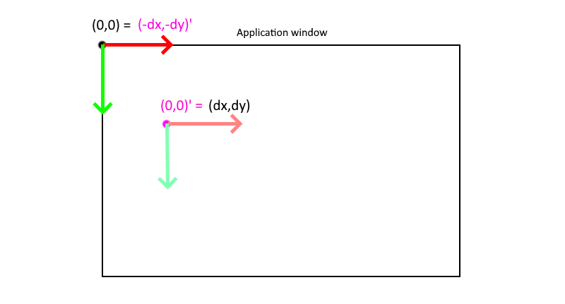

Given that the position of the player is `x` and `y` in a particular frame, the default frame of reference is translated by $$(-x + \frac{screen\space width}{2}, -y +\frac{screen\space height}{2})$$. Therefore $$(x,y)' = (\frac{screen\space width}{2},\frac{screen\space height}{2})$$, which means the player's position will be equal to the position of the center of the screen.

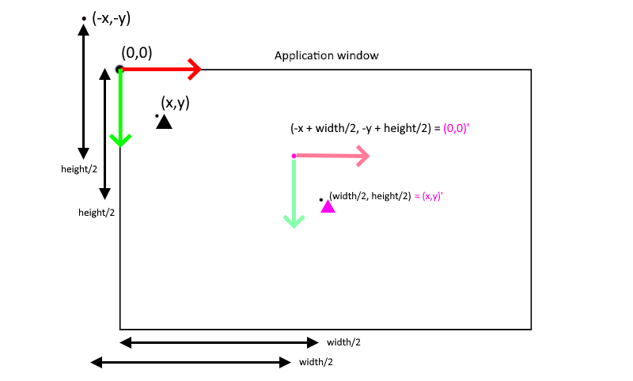

In `love.draw()`, the frame of reference is translated and only then is the player is drawn. This ensures the player stays at the center of the screen in every frame. All other scene objects are also drawn in the new frame of reference.

Due to the fact that images are pivoted at the top left corner, the translated player will appear to be slightly off-centered to the right and down. To correct for this behaviour, half of the image width and height of the player are subtracted on top of the player's position. This will align the center of the image to the center of the screen.


> `love.graphics.translate()` is only called once per frame to center the player, everything else that are drawn in the new frame of reference appears to move relative to the player.

The player in this game is placed at two-thirds of the screen's height instead of exactly half as shown in the example above. As a result, `dy` is `-player.y - player.image:getHeight()/2 + love.graphics.getHeight()*2/3` instead of `-player.y - player.image:getHeight()/2 + love.graphics.getHeight()*2`.

```lua

function love.draw()

    ----draws dynamic scene-----

    love.graphics.push()

        dx = -player.x - player.image:getWidth()/2 + love.graphics.getWidth()/2
        dy = -player.y - player.image:getHeight()/2 + love.graphics.getHeight()*2/3
        love.graphics.translate(dx,dy)

        -----------------draw the player here

        --animation--
        player:draw()

        -----------------draw the objects and map here

        --entities--
        for k, v in ipairs(objects) do
            if not v:is(Player) then
                v:draw()
            end

        end

        for k, v in ipairs(walls) do
            v:draw()
        end

        --end flag animation--
        love.graphics.draw(flag.flagIMG, flag.flagQuads[math.floor(flag.currentFrame)],flag.x,flag.y)


    love.graphics.pop()

    -------draw other on-screen ui-------

    -- use the default coordinate system!
    -- static graphics are draw on top of the scene!

end
```
*`love.graphics.push()` stores the current graphics settings to the stack and `love.graphics.pop()` retrieves those settings from the stack and apply them.*

## Text Flash Effect

Some text in this game have a flashing effect. To animate a text component, a timer variable `textFadeTimer` is counted down from half of `period` to half of -`period`. The absolute value of timer is then divided by half of `period` and stored into a global variable `textAlpha`. The value of `textAlpha` will lerp from 1 to 0 and then back to 1 again.

>`loopValue()` is called inside `love.update()`. The argument `period` passed in to the function `loopValue()` is a constant defined in `love.load()` that can be adjusted for design purposes.


```lua
function love.update(dt)

    if game.state.menu then

       loopValue(dt,menuTextPeriod)

    end

end
```
*`menuTextPeriod` describes the constant period of which the menu text flashes in seconds.*

```lua
--forces a value to go from 1 to 0 back to 1 non stop
function loopValue (dt,period)

    --forces timer to go from period/2 -> - period/2 in exactly 1 period
    if textFadeTimer > -1 * period/2 then

        textFadeTimer =  textFadeTimer - dt

    else

        textFadeTimer = period/2

    end

    textAlpha = math.abs(textFadeTimer/(period/2))

    if textAlpha > 0.9 then
        textAlpha = 0.9
    end

end
```
In `love.draw()`, in every frame before the text is printed on the screen, the pen colour's opacity is set to `textAlpha`.

> The text "Press SpaceBar to Play" will now appear to fade in and fade out with time.

```lua
function love.draw()

    if game.state.menu then

        love.graphics.setColor(1,1,1,TextAlpha)
        love.graphics.printf("Press SpaceBar to Play", 0, WINDOWS_HEIGHT /2  ,WINDOWS_WIDTH,"center")

    end

end
```


# Credits

This game is inspired by <a href="https://sheepolution.com/learn" > Sheepolution's tutorial on how to love</a>. The physics system and overall data structure this game uses is a modified version of that in the tutorial. Sheepolution's tutorial is an essential beginner's starter pack if they are new to LOVE and lua.
